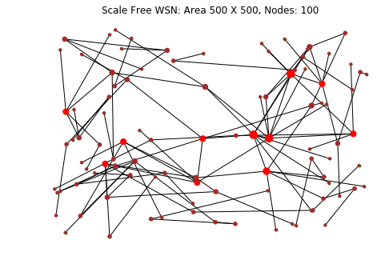
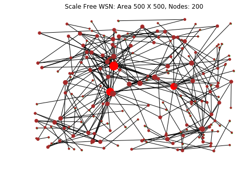
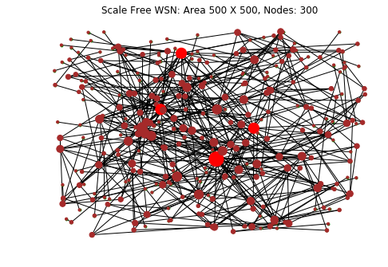
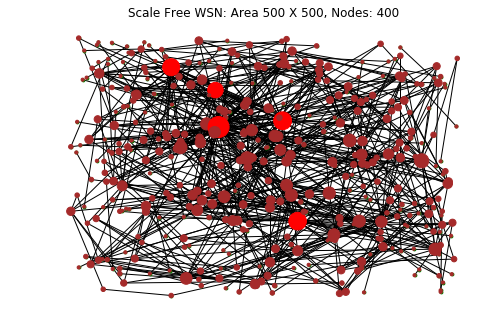
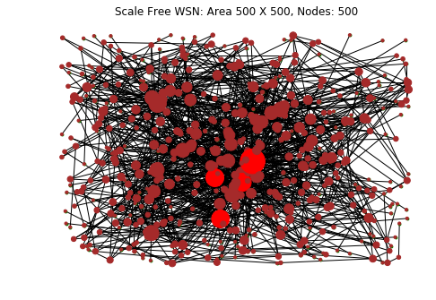
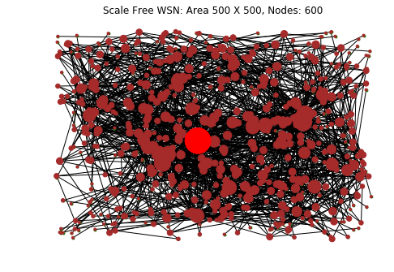
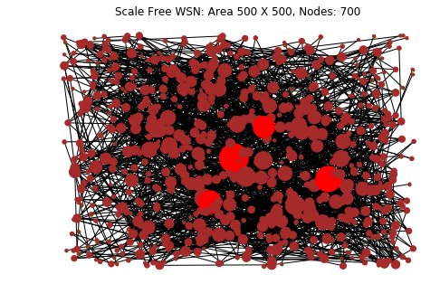
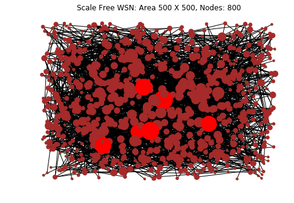

# Scale-free-WSN
This is my final year project.

## Results

For WSN of area 500X500

#### Nodes: 100, m = 1 

| WSN Network  | .png)Degree Vs Node Count | .png)Robusness |
|:---:|:---:|:---:|

#### Nodes: 200, m = 1 
| WSN Network  | .png)Degree Vs Node Count | .png)Robusness |
|:---:|:---:|:---:|

#### Nodes: 300, m = 1 
| WSN Network  | .png)Degree Vs Node Count | .png)Robusness |
|:---:|:---:|:---:|

#### Nodes: 400, m = 1 
| WSN Network  | .png)Degree Vs Node Count | .png)Robusness |
|:---:|:---:|:---:|

#### Nodes: 500, m = 1 
| WSN Network  | .png)Degree Vs Node Count | .png)Robusness |
|:---:|:---:|:---:|

#### Nodes: 600, m = 1 
| WSN Network  | .png)Degree Vs Node Count | .png)Robusness |
|:---:|:---:|:---:|

#### Nodes: 700, m = 1 
| WSN Network  | .png)Degree Vs Node Count | .png)Robusness |
|:---:|:---:|:---:|

#### Nodes: 800, m = 1 
| WSN Network  | .png)Degree Vs Node Count | .png)Robusness |
|:---:|:---:|:---:|
